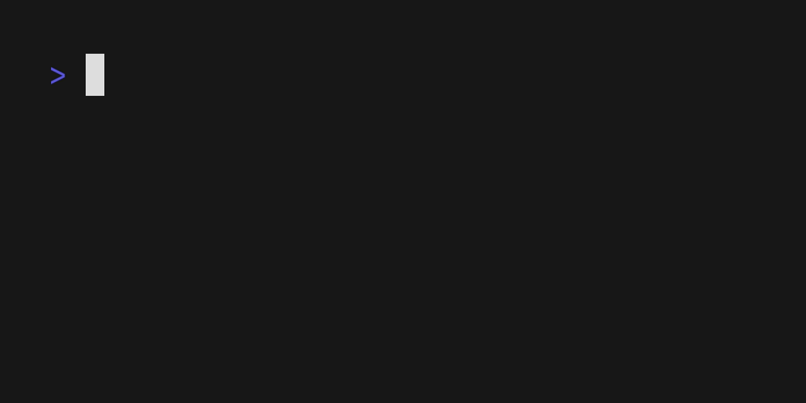

# VHS Action

Keep your GIFs up to date with VHS + GitHub actions 📽️

The above GIF is automatically generated on CI with GitHub actions and VHS.

[vhs]: https://github.com/charmbracelet/vhs

## Getting Started

To get started with GitHub actions you can [read the documentation](https://docs.github.com/en/actions).

To add `vhs-action` to your project you will need to:

1. Create `.github/workflows/vhs.yml` in your project directory.
2. Copy one of the [`examples/`](./examples/) into your `vhs.yml`.
3. Create your `vhs.tape` file with the instructions to perform (See [VHS](https://github.com/charmbracelet/vhs) instructions on `.tape` files)
4. Trigger your action by creating a pull request or making a commit depending on your `vhs.yml` file.

That's all! Anytime the action is triggered, GitHub actions and VHS will regenerate the GIF from your `.tape` file on CI.
This is useful for keeping demos updated and performing integration testing to catch errors in your PRs.

## Inputs

Name                  | Description                      | Default
---------------       | --------------------------       | ---------------------
`path`                | Path of the VHS .tape file       | ``"vhs.tape"``
`version`             | Version of VHS to use            | ``"latest"``
`token`               | GitHub token to use              | ``"${{ github.token }}"``
`install-fonts`       | Whether to install extra fonts   | ``"false"``

## Examples

* Auto-commit latest generated GIF file ([example](./examples/auto-commit.yml))
* Upload GIF to host and comment generated GIF on a pull request ([example](./examples/comment-pr.yml))

## Feedback

We’d love to hear your thoughts on this project. Feel free to drop us a note!

* [Twitter](https://twitter.com/charmcli)
* [The Fediverse](https://mastodon.social/@charmcli)
* [Discord](https://charm.sh/chat)

## License

[MIT](https://github.com/charmbracelet/vhs/raw/main/LICENSE)

***

Part of [Charm](https://charm.sh).

Charm热爱开源 • Charm loves open source
